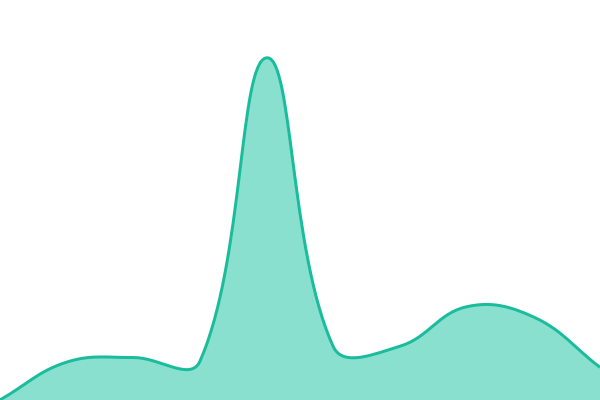
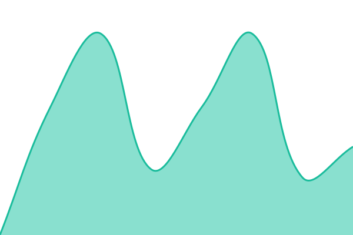

# [📈 Live Status](https://status.orsf.sk): <!--live status--> **🟩 All systems operational**

This repository contains the open-source uptime monitor and status page for [jakubnovak710](https://status.orsf.sk), powered by [Upptime](https://github.com/upptime/upptime).

With [Upptime](https://upptime.js.org), you can get your own unlimited and free uptime monitor and status page, powered entirely by a GitHub repository. We use [Issues](https://github.com/jakubnovak710/orsf-status/issues) as incident reports, [Actions](https://github.com/jakubnovak710/orsf-status/actions) as uptime monitors, and [Pages](https://status.orsf.sk) for the status page.

<!--start: status pages-->
<!-- This summary is generated by Upptime (https://github.com/upptime/upptime) -->
<!-- Do not edit this manually, your changes will be overwritten -->
<!-- prettier-ignore -->
| URL | Status | History | Response Time | Uptime |
| --- | ------ | ------- | ------------- | ------ |
|  [Web (orsf.sk)](https://orsf.sk) | 🟩 Up | [web-orsf-sk.yml](https://github.com/jakubnovak710/orsf-status/commits/HEAD/history/web-orsf-sk.yml) | 

 1116ms
     
 | 

<a href="https://status.orsf.sk/history/web-orsf-sk">100.00%</a>
    

|  [API (api.orsf.sk)](https://api.orsf.sk/healthz) | 🟩 Up | [api-api-orsf-sk.yml](https://github.com/jakubnovak710/orsf-status/commits/HEAD/history/api-api-orsf-sk.yml) | 

 756ms
     
 | 

<a href="https://status.orsf.sk/history/api-api-orsf-sk">100.00%</a>
    

|  [API readyz (DB + Redis)](https://api.orsf.sk/readyz) | 🟩 Up | [api-readyz-db-redis.yml](https://github.com/jakubnovak710/orsf-status/commits/HEAD/history/api-readyz-db-redis.yml) | 

 564ms
     
 | 

<a href="https://status.orsf.sk/history/api-readyz-db-redis">100.00%</a>
    

|  [IČO lookup (autofill)](https://api.orsf.sk/v1/lookup/55609830) | 🟩 Up | [ico-lookup-autofill.yml](https://github.com/jakubnovak710/orsf-status/commits/HEAD/history/ico-lookup-autofill.yml) | 

 511ms
     
 | 

<a href="https://status.orsf.sk/history/ico-lookup-autofill">100.00%</a>
    

|  [Search](https://api.orsf.sk/v1/search?q=test&limit=1) | 🟩 Up | [search.yml](https://github.com/jakubnovak710/orsf-status/commits/HEAD/history/search.yml) | 

 757ms
     
 | 

<a href="https://status.orsf.sk/history/search">100.00%</a>
    

|  [Company detail](https://api.orsf.sk/v1/companies/55609830) | 🟩 Up | [company-detail.yml](https://github.com/jakubnovak710/orsf-status/commits/HEAD/history/company-detail.yml) | 

 649ms
     
 | 

<a href="https://status.orsf.sk/history/company-detail">100.00%</a>
    

|  [Ingestor freshness](https://api.orsf.sk/v1/status) | 🟩 Up | [ingestor-freshness.yml](https://github.com/jakubnovak710/orsf-status/commits/HEAD/history/ingestor-freshness.yml) | 

 551ms
     
 | 

<a href="https://status.orsf.sk/history/ingestor-freshness">100.00%</a>
    

|  [OpenAPI spec](https://api.orsf.sk/v1/openapi.json) | 🟩 Up | [open-api-spec.yml](https://github.com/jakubnovak710/orsf-status/commits/HEAD/history/open-api-spec.yml) | 

 383ms
     
 | 

<a href="https://status.orsf.sk/history/open-api-spec">100.00%</a>
    

<!--end: status pages-->

[**Visit our status website →**](https://status.orsf.sk)

## 📄 License

- Powered by: [Upptime](https://github.com/upptime/upptime)
- Code: [MIT](./LICENSE) © [Anand Chowdhary](https://anandchowdhary.com), supported by [Pabio](https://pabio.com)
- Data in the `./history` directory: [Open Database License](https://opendatacommons.org/licenses/odbl/1-0/)
